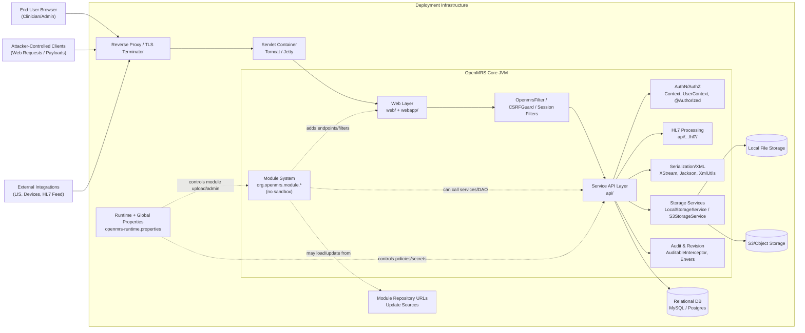
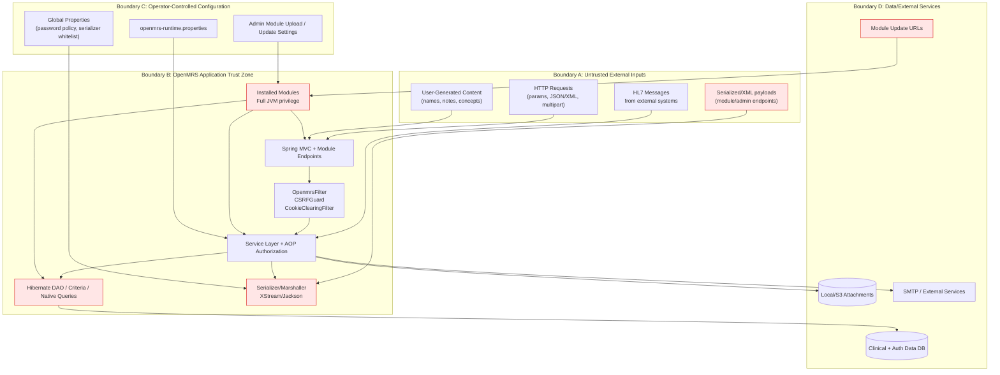
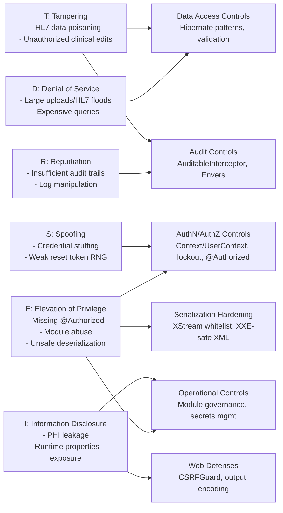
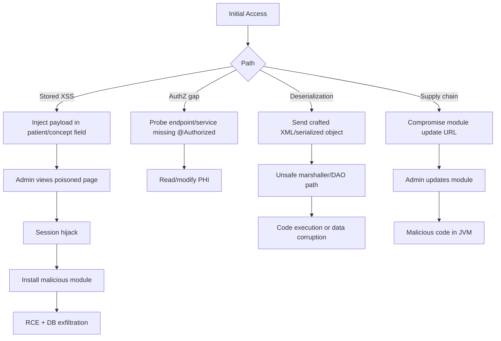

# OpenMRS Core Threat Model Diagrams

This document translates the supplied threat model into visual diagrams for architecture, trust boundaries, and prioritized threats.

## 1) High-Level Architecture (Deployment / Component View)



## 2) Trust Boundary Diagram (Threat-Focused DFD)



## 3) STRIDE-Style Threat Mapping Diagram



## 4) Attack Paths (Kill Chain View)



## 5) Critical Risk Heatmap (from supplied calibration)

```mermaid
quadrantChart
  title OpenMRS Threat Priority (Impact vs Likelihood)
  x-axis Low Likelihood --> High Likelihood
  y-axis Low Impact --> High Impact
  quadrant-1 Monitor
  quadrant-2 Reduce
  quadrant-3 Review
  quadrant-4 Immediate Action
  "Stored XSS -> Admin Hijack" : [0.67, 0.82]
  "Missing @Authorized / Priv Esc" : [0.60, 0.90]
  "Unsafe Deserialization RCE" : [0.45, 0.98]
  "Module Upload/Update Compromise" : [0.40, 1.00]
  "SQL/HQL Injection" : [0.50, 0.96]
  "CSRF on non-critical action" : [0.62, 0.42]
  "Password reset token predictability" : [0.58, 0.48]
  "Version/banner info leak" : [0.78, 0.18]
```

## 6) Diagram Notes and Usage

- The **Module System** is explicitly modeled as a **high-trust, high-impact boundary** because installed modules run with full JVM permissions and can bypass normal guardrails.
- The **serialization path** (XStream/XML/Jackson plus serialized-object persistence) is highlighted as a critical control point where whitelist misconfiguration can create RCE conditions.
- The **operator configuration boundary** is shown separately because runtime/global properties directly influence security posture (lockout, serializer whitelist, module upload).
- Use these diagrams in design reviews to ensure every new endpoint/module change is checked for: authentication, authorization, output encoding, CSRF, validation, and secure serialization.

## 7) How to View These Diagrams

You can view these Mermaid diagrams in several ways:

1. **On GitHub/GitLab UI (recommended)**
   - Open `doc/THREAT_MODEL_DIAGRAMS.md` in the repository web UI.
   - Mermaid code blocks are rendered automatically in modern GitHub markdown viewers.

2. **In VS Code**
   - Open this file in VS Code.
   - Use Markdown preview (`Ctrl+Shift+V` / `Cmd+Shift+V`).
   - If Mermaid is not rendered by your current setup, install a Markdown Mermaid preview extension.

3. **In Mermaid Live Editor**
   - Go to [https://mermaid.live](https://mermaid.live).
   - Copy one Mermaid block (between ```mermaid ... ```), paste it into the editor, and render/export PNG/SVG.

4. **From CLI (optional)**
   - If `@mermaid-js/mermaid-cli` is installed, save a diagram block as `.mmd` and run:
     - `mmdc -i diagram.mmd -o diagram.svg`

If you want, I can also split this file into:
- `doc/diagrams/architecture.mmd`
- `doc/diagrams/trust-boundary.mmd`
- `doc/diagrams/attack-paths.mmd`

so each diagram can be rendered/exported independently in CI.
